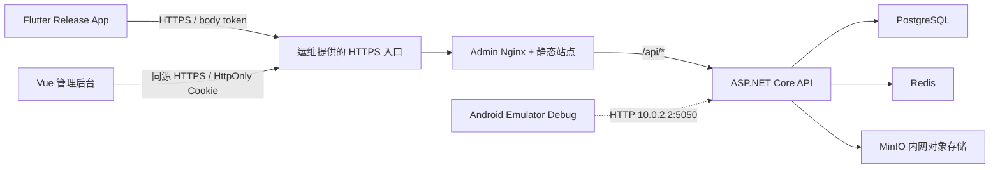
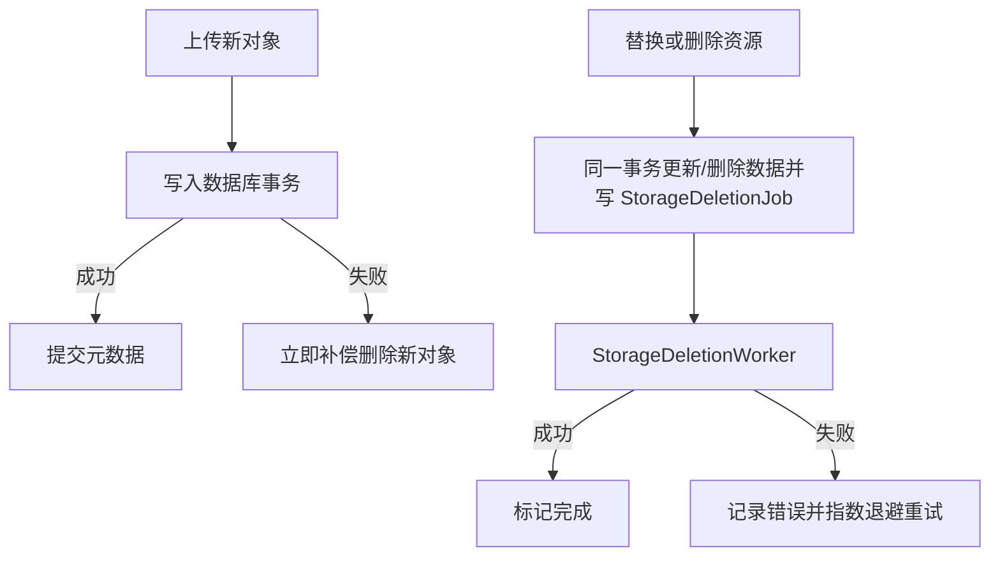
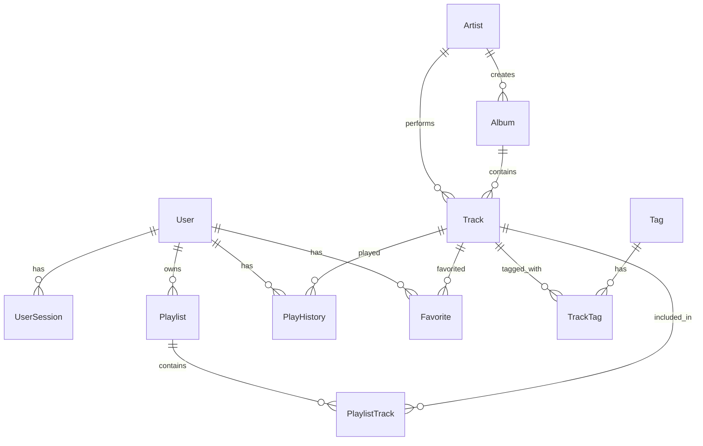

# Follow 家庭音乐后端技术分析

> 基于 .NET 10 的家庭音乐库服务。产品范围是家庭成员共享音乐、个人收藏/历史/歌单和多端播放。

## 1. 系统边界



- 仓库不内置 TLS 网关；生产由运维提供唯一的公共 HTTPS origin。Web 静态资源、`/api/*`、封面、歌词和音频播放均使用该 origin。
- Compose 仅把 Admin `3000` 与 API `5050` 绑定到宿主机 loopback。PostgreSQL、Redis 与 MinIO 不发布宿主机端口，数据服务通过 `docker compose exec` 维护。
- Android Emulator Debug 是唯一明文例外，通过 `10.0.2.2:5050` 访问宿主机 API；Profile、Release 和非本地 origin 仍强制 HTTPS。
- API 只信任显式配置的反向代理转发头，避免伪造客户端 IP 或 HTTPS scheme 后绕过安全策略和限流分区。

## 2. 技术栈

| 层 | 技术 | 职责 |
|---|---|---|
| API | .NET 10、ASP.NET Core Minimal API | 路由、认证、授权、限流、媒体响应 |
| 数据 | EF Core 10、Npgsql、PostgreSQL 18 | 领域数据、设备会话、对象删除任务 |
| 缓存 | Redis 8 | 缓存基础设施 |
| 对象存储 | MinIO | 音频、封面、歌词对象 |
| 元数据 | TagLibSharp | 音频标签和内嵌封面提取 |
| 测试 | xUnit | 契约、服务和端点验证 |

## 3. 项目结构

```text
follow-server/
├── src/
│   ├── Follow.Api/
│   │   ├── Auth/                 # Cookie 传输
│   │   ├── Endpoints/            # Minimal API 端点
│   │   ├── Media/                # 路径策略、Range 解析、流式结果
│   │   ├── Middleware/           # 统一异常响应
│   │   ├── RateLimiting/         # 限流策略
│   │   ├── Security/             # 可信 Forwarded Headers
│   │   └── Program.cs
│   ├── Follow.Core/
│   │   ├── Entities/             # 领域实体
│   │   ├── Interfaces/           # 服务接口
│   │   └── Services/             # 领域规则
│   ├── Follow.Infrastructure/
│   │   ├── Data/                 # DbContext 与 EF 迁移
│   │   └── Services/             # 数据库、MinIO、认证、后台 worker
│   └── Follow.Shared/
│       ├── Constants/
│       └── DTOs/
└── tests/
    ├── Follow.Api.Tests/
    └── Follow.Core.Tests/
```

依赖方向保持为 API/Infrastructure 依赖 Core 与 Shared；Core 不依赖具体的数据库或对象存储实现。

## 4. 认证与会话

### 4.1 传输契约

登录、注册和刷新请求通过 `tokenTransport` 明确客户端类型：

| 模式 | Access Token | Refresh Token | 适用端 |
|---|---|---|---|
| `cookie` | `follow_access`，`Path=/api` | `follow_refresh`，`Path=/api/auth` | Web 管理后台 |
| `body` | `AuthResponse.accessToken` | `AuthResponse.refreshToken` | Flutter App |

Cookie 均为 `HttpOnly`、`Secure`、`SameSite=Strict`。`cookie` 模式下 JSON 中的两个 token 必须为 `null`，浏览器 JavaScript 不保存或拼接 `Authorization`。`body` 模式由 App 将令牌写入平台安全存储；普通偏好存储只允许保存非敏感信息，例如记住的用户名或邮箱。

### 4.2 `UserSession` 模型

每次登录创建一个设备会话，核心字段包括：

| 字段 | 说明 |
|---|---|
| `UserId` | 会话所属用户 |
| `RefreshTokenHash` | 当前 Refresh Token 的不可逆哈希；数据库不保存明文 |
| `PreviousRefreshTokenHash` | 用于识别轮换后的令牌重放 |
| `DeviceName` / `ClientType` / `UserAgent` | 设备展示和审计信息 |
| `LastUsedAt` / `ExpiresAt` | 最近使用与到期时间 |
| `RotatedAt` / `RevokedAt` / `RevokedReason` | 轮换、撤销和原因 |
| `Version` | 并发更新控制 |

Access Token 包含 `sid`。JWT 签名和有效期通过后，API 仍会校验对应 `UserSession` 未过期、未撤销，因此注销或远程撤销会立即阻止旧 Access Token 继续访问。

### 4.3 会话端点

| 方法 | 路径 | 行为 |
|---|---|---|
| POST | `/api/auth/register` | 创建 Member 和独立设备会话 |
| POST | `/api/auth/login` | 以 `identifier`（用户名或邮箱）和密码登录并创建独立设备会话；不接受旧 `email` 登录字段 |
| POST | `/api/auth/refresh` | 校验并轮换当前会话 Refresh Token |
| POST | `/api/auth/logout` | 撤销当前 `sid` 并清除 Web Cookie |
| POST | `/api/auth/logout-all` | 撤销当前用户全部设备会话 |
| GET | `/api/auth/sessions` | 返回当前用户设备列表和 `isCurrent` |
| DELETE | `/api/auth/sessions/{id}` | 撤销当前用户指定设备；禁止跨用户操作 |
| GET | `/api/auth/me` | 返回当前用户信息 |

`SessionDto` 返回 `id`、`deviceName`、`clientType`、`createdAt`、`lastUsedAt`、`expiresAt` 和 `isCurrent`，不返回任何令牌哈希或明文令牌。

无效或过期凭据返回 `401`，权限不足返回 `403`，输入不合法返回 `400`，唯一性冲突返回 `409`。客户端只在 `401` 时尝试一次 refresh；并发 `401` 共享一次刷新，失败后停止重放并回到登录页。

### 4.4 限流

ASP.NET Core Rate Limiting 按真实客户端 IP 或认证用户分区：

| 策略 | 默认限制 |
|---|---|
| 注册 | 每 IP 每小时 3 次 |
| 登录 | 每 IP 每分钟 5 次 |
| 刷新 | 每 IP 每分钟 10 次 |
| 普通 API | 每用户或 IP 每分钟 120 次 |
| 上传 | 每用户或 IP 每小时 20 次 |
| 播放 | 每用户或 IP 并发 3 路 |

限制可由 `RateLimiting.*` 配置覆盖。拒绝时返回统一 JSON `429` 和 `Retry-After`，客户端不得无间隔重试。

## 5. 媒体访问与对象安全

### 5.1 真实流式播放

`GET`/`HEAD /api/tracks/{id}/stream` 先读取对象元数据，再把需要的字节区间直接复制到响应体：

| 请求 | 响应 |
|---|---|
| 无 `Range` | `200`、完整 `Content-Length`、`Accept-Ranges: bytes` |
| 合法单段 `Range` | `206`、准确 `Content-Range` 和分段长度 |
| 越界、格式错误或多段 `Range` | `416`、`Content-Range: bytes */<length>` |
| `HEAD` | 与对应 `GET` 相同的状态和头，不写响应体 |

流式复制支持请求取消，并把 offset/length 下推到 MinIO SDK；服务端不使用整文件 `MemoryStream`，因此大文件播放和拖动不会按整首音乐占用内存。

### 5.2 匿名封面代理

`GET /api/tracks/cover/{path}` 只允许以下受管前缀中的图片扩展名：

- `covers/`
- `artists/`
- `albums/`

路径穿越、绝对路径、音频/歌词扩展、其他前缀和任意 MinIO key 均返回不可用结果。音频和歌词必须经过认证的曲目端点，客户端不能直接访问 MinIO。

### 5.3 数据库与对象一致性

对象存储不参与 PostgreSQL 事务，因此采用“数据库事务 + 补偿 + 持久删除任务”：



`StorageDeletionQueue` 只接受受管对象前缀。曲目删除会在同一数据库事务处理曲目关系并排队清理音频、封面和歌词；艺术家/专辑封面替换或删除同样排队清理旧对象。任务失败不会丢失，可由后台 worker 重试。

## 6. 数据模型



主要删除行为：

| 关系 | 数据库行为 |
|---|---|
| `UserSession → User` | 用户删除时级联删除会话 |
| `Playlist → User` | 级联 |
| `PlaylistTrack → Playlist/Track` | 级联 |
| `PlayHistory/Favorite → User/Track` | 级联 |
| `Track → Artist/Album` | 置空 |
| `Album → Artist` | 置空 |

`StorageDeletionJob` 是独立的持久后台任务，保存对象路径、尝试次数、下次执行时间、完成时间和最后错误；它不以客户端提供的任意路径作为删除目标。

## 7. 歌单所有权与排序

- 私有歌单只对所有者可见；公开歌单对其他已认证家庭成员只读。
- 所有写操作都以 JWT 用户 ID 在服务端校验所有权，不能依赖客户端传入的 owner 或 UI 是否显示编辑按钮。
- 歌单响应提供 `ownerId`、`ownerName`、`isOwnedByCurrentUser` 和 `canEdit`；Flutter 只在 `canEdit` 为真时显示更新、删除、增删曲目和重排入口。
- 重排请求必须是当前歌单曲目 ID 的完整、无重复排列；缺项、重复、外来曲目或非所有者请求不会产生部分更新。

## 8. 分页契约

列表接口统一遵守以下原则：

- `page` 从 1 开始；`pageSize` 或 `limit` 必须在 `1..100`。
- 非法页码或大小返回 `400`，不能通过负数、零或超大值触发无界查询。
- 查询使用 `AsNoTracking`，先按业务字段排序，再以实体 ID 作稳定次级排序。
- 分页元数据至少包含当前页、页大小、总记录数和总页数；空结果的总页数为 0。
- 曲目筛选、管理员用户列表和标签曲目分页的计数与数据查询使用相同条件；播放历史的 `limit` 也执行 `1..100` 边界校验和稳定排序。

## 9. API 模块

| 模块 | 路径 | 主要能力 | 权限 |
|---|---|---|---|
| 认证 | `/api/auth` | 注册、登录、刷新、注销、设备会话 | 公开/认证 |
| 曲目 | `/api/tracks` | 列表、元数据、Range 播放、封面、歌词、标签 | 认证/管理员 |
| 艺术家 | `/api/artists` | 列表、详情、维护、封面 | 认证/管理员 |
| 专辑 | `/api/albums` | 列表、详情、维护、封面 | 认证/管理员 |
| 标签 | `/api/tags` | 标签及其曲目 | 认证/管理员 |
| 歌单 | `/api/playlists` | 私有/公开读取、所有者写入、重排 | 认证 |
| 用户音乐 | `/api/user` | 收藏、播放历史 | 认证 |
| 管理员 | `/api/admin` | 仪表盘、创建/维护用户 | Admin |
| 健康检查 | `/health` | 服务健康状态 | 公开 |

支持的上传格式：

- 音频：`.mp3`、`.flac`、`.wav`、`.aac`、`.ogg`、`.m4a`
- 图片：`.jpg`、`.jpeg`、`.png`、`.webp`、`.gif`
- 歌词：`.lrc`、`.txt`

播放历史按用户和曲目 upsert，只保留最近一次；每个用户最多保留 300 条，按播放时间倒序读取。

## 10. 配置与部署

### 10.1 关键配置

| 配置 | 说明 |
|---|---|
| `ConnectionStrings.DefaultConnection` | PostgreSQL 连接字符串 |
| `JwtSettings.*` | JWT 签名、issuer、audience、Access/Refresh 有效期 |
| `MinioSettings.*` | API 到内部 MinIO 的连接和 bucket |
| `RedisSettings.ConnectionString` | Redis 连接 |
| `RateLimiting.*` | 各限流窗口和并发数 |
| `ForwardedHeaders.KnownProxies` / `KnownNetworks` | 上线时由运维显式配置的可信 HTTPS 代理地址或 CIDR；本地 Compose 不默认信任转发头 |
| `AdminAccount.*` | 启动时维护的管理员账号 |

生产敏感值从根目录 `.env` 注入，不把 MinIO/JWT/数据库密码写入 Web 包、App 偏好存储或文档示例。

### 10.2 完整栈

```bash
cp .env.example .env
# 替换所有占位值
docker compose up -d --build
```

本机管理后台使用 `http://127.0.0.1:3000`，API 诊断使用 `http://127.0.0.1:5050`。生产必须在 Admin loopback 端口前配置真实域名和公共可信 HTTPS；API 通过 Docker 服务名连接内网 MinIO，该容器地址不是客户端或公网入口。

### 10.3 开发验证

```bash
dotnet ef database update \
  --project follow-server/src/Follow.Infrastructure \
  --startup-project follow-server/src/Follow.Api

dotnet test follow-server/tests/Follow.Api.Tests
dotnet test follow-server/tests/Follow.Core.Tests
```

Production 启动会自动应用 EF Core 迁移并维护环境指定的管理员。上线前仍需备份真实 PostgreSQL、验证迁移、确认公共 HTTPS 证书与代理配置、检查 Range/Cookie/多设备注销和对象删除 worker；自动化测试不能替代真实浏览器、真实设备和局域网验证。

## 11. 设计结论

当前架构以家庭网络的低运维成本为目标，同时保留清晰的安全边界：

1. 单一 HTTPS origin 解决 Cookie、媒体播放和跨端地址漂移问题。
2. 哈希化、可撤销的多设备 Session 让注销真正生效，不再依赖单个用户字段中的明文 Refresh Token。
3. Range 下推和响应体直传让播放、暂停和拖动符合真实流媒体语义。
4. 持久删除任务把 PostgreSQL 与 MinIO 的最终一致性变成可观察、可重试的工作流。
5. 服务端所有权、完整重排和有界稳定分页避免客户端 UI 成为安全边界。
