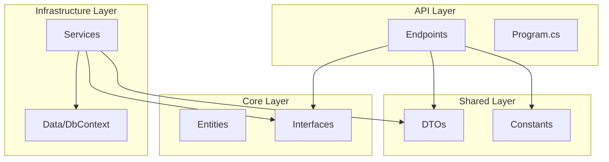
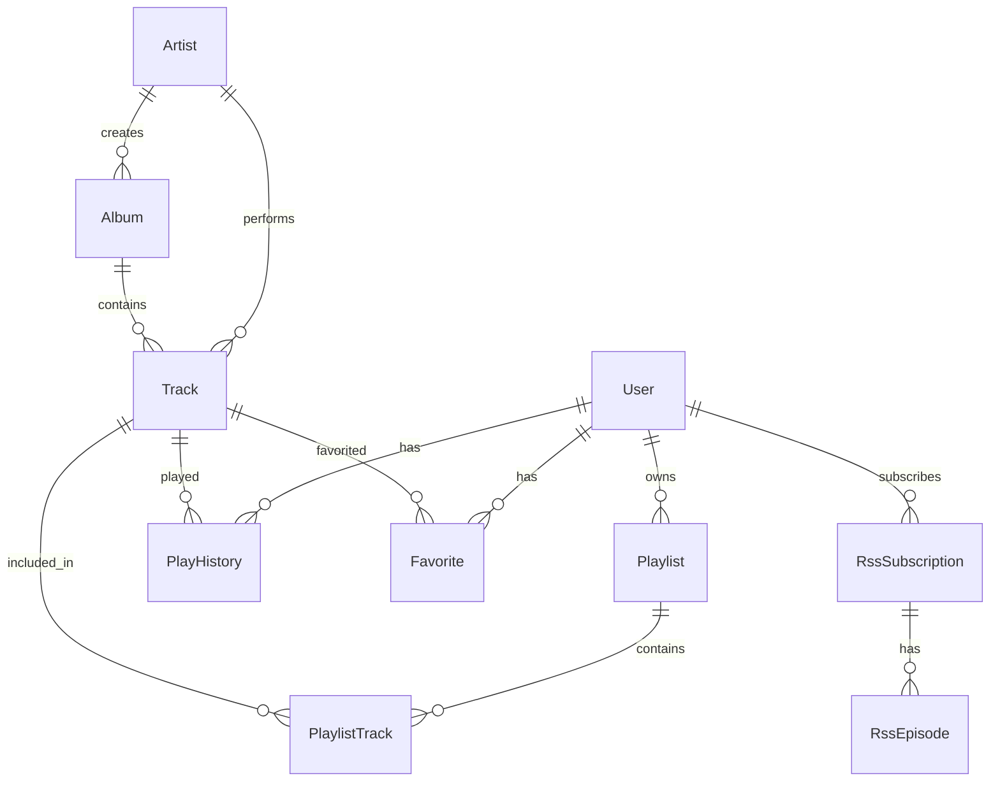

# Follow Music Player Backend - 技术分析文档

> 基于 .NET 10 的跨平台音乐播放器后端服务

## 目录

- [技术栈概览](#技术栈概览)
- [项目结构](#项目结构)
- [架构设计](#架构设计)
- [数据库设计](#数据库设计)
- [API 模块](#api-模块)
- [配置与脚本](#配置与脚本)
- [部署方案](#部署方案)

---

## 技术栈概览

### 核心框架

| 技术 | 版本 | 用途 |
|------|------|------|
| **.NET** | 10.0 | 运行时框架 |
| **ASP.NET Core** | 10.0 | Web API 框架 (Minimal API) |
| **Entity Framework Core** | 10.0.1 | ORM 框架 |
| **Npgsql.EntityFrameworkCore.PostgreSQL** | 10.0.0 | PostgreSQL 数据库驱动 |

### 数据存储

| 技术 | 版本 | 用途 |
|------|------|------|
| **PostgreSQL** | 18 | 关系型数据库 |
| **Redis** | 8 (Alpine) | 缓存服务 |
| **MinIO** | Latest | 对象存储 (音乐/封面/歌词) |

### 核心依赖库

| 包 | 版本 | 用途 |
|---|------|------|
| `Microsoft.AspNetCore.Authentication.JwtBearer` | 10.0.1 | JWT 认证 |
| `Swashbuckle.AspNetCore` | 10.1.0 | Swagger API 文档 |
| `Minio` | 7.0.0 | MinIO SDK |
| `StackExchange.Redis` | 2.10.1 | Redis 客户端 |
| `System.IdentityModel.Tokens.Jwt` | 8.15.0 | JWT Token 处理 |
| `TagLibSharp` | 2.3.0 | 音频元数据提取 |

### 测试框架

| 包 | 版本 | 用途 |
|---|------|------|
| `xunit` | 2.9.3 | 单元测试框架 |
| `Microsoft.NET.Test.Sdk` | 17.14.1 | 测试 SDK |
| `coverlet.collector` | 6.0.4 | 代码覆盖率 |

---

## 项目结构

### 整体目录结构

```
follow-server/
├── docker-compose.yml       # Docker 开发环境配置
├── Dockerfile               # 生产环境容器构建
├── Follow.slnx              # 解决方案文件
├── README.md                # 项目说明文档
├── docs/                    # 文档目录
│   └── technical-analysis.md
├── src/                     # 源代码
│   ├── Follow.Api/          # API 入口层
│   ├── Follow.Core/         # 核心领域层
│   ├── Follow.Infrastructure/  # 基础设施层
│   └── Follow.Shared/       # 共享层
└── tests/                   # 测试项目
    ├── Follow.Api.Tests/
    └── Follow.Core.Tests/
```

### 分层详解

#### 1. Follow.Api (API 入口层)

```
Follow.Api/
├── Endpoints/               # API 端点定义
│   ├── AdminEndpoints.cs
│   ├── AlbumEndpoints.cs
│   ├── ArtistEndpoints.cs
│   ├── AuthEndpoints.cs
│   ├── PlaylistEndpoints.cs
│   ├── RssEndpoints.cs
│   ├── TrackEndpoints.cs
│   └── UserMusicEndpoints.cs
├── Properties/
│   └── launchSettings.json
├── Program.cs               # 应用入口和配置
├── appsettings.json         # 基础配置
├── appsettings.Development.json  # 开发环境配置
└── Follow.Api.csproj
```

**职责**: HTTP 请求处理、路由定义、中间件配置、依赖注入配置

#### 2. Follow.Core (核心领域层)

```
Follow.Core/
├── Entities/               # 领域实体
│   ├── BaseEntity.cs
│   ├── User.cs
│   ├── Track.cs
│   ├── Artist.cs
│   ├── Album.cs
│   ├── Playlist.cs
│   ├── PlaylistTrack.cs
│   ├── PlayHistory.cs
│   ├── Favorite.cs
│   ├── RssSubscription.cs
│   └── RssEpisode.cs
├── Interfaces/             # 服务接口定义
│   ├── IAdminService.cs
│   ├── IAuthService.cs
│   ├── IJwtService.cs
│   ├── IMusicServices.cs
│   ├── IPasswordHasher.cs
│   ├── IPlaylistService.cs
│   ├── IRssService.cs
│   ├── IStorageService.cs
│   ├── ITrackService.cs
│   └── IUserMusicService.cs
└── Follow.Core.csproj
```

**职责**: 领域模型定义、业务接口声明、领域规则

#### 3. Follow.Infrastructure (基础设施层)

```
Follow.Infrastructure/
├── Data/
│   ├── FollowDbContext.cs   # 数据库上下文
│   └── Migrations/          # EF Core 迁移
│       ├── 20251228144621_InitialCreate.cs
│       ├── 20251229065708_AddLyricsUrlToTrack.cs
│       └── FollowDbContextModelSnapshot.cs
├── Services/               # 服务实现
│   ├── AdminService.cs
│   ├── AlbumService.cs
│   ├── ArtistService.cs
│   ├── AuthService.cs
│   ├── JwtService.cs
│   ├── MinioStorageService.cs
│   ├── PasswordHasher.cs
│   ├── PlaylistService.cs
│   ├── RssService.cs
│   ├── TrackService.cs
│   └── UserMusicService.cs
└── Follow.Infrastructure.csproj
```

**职责**: 数据访问、外部服务集成、接口实现

#### 4. Follow.Shared (共享层)

```
Follow.Shared/
├── Constants/
│   └── Roles.cs            # 角色和策略常量
├── DTOs/
│   ├── AuthDtos.cs         # 认证相关 DTO
│   ├── MusicDtos.cs        # 音乐相关 DTO
│   └── PlaylistDtos.cs     # 播放列表 DTO
└── Follow.Shared.csproj
```

**职责**: 跨层共享的数据传输对象、常量定义

---

## 架构设计

### 整体架构模式

本项目采用 **Clean Architecture (整洁架构)** 的变体，结合 **Minimal API** 模式：



### 依赖关系

```
Follow.Api
├── Follow.Core
├── Follow.Infrastructure
└── Follow.Shared

Follow.Infrastructure
├── Follow.Core
└── Follow.Shared

Follow.Core
└── Follow.Shared

Follow.Shared
└── (无依赖)
```

### 关键架构模式

#### 1. Minimal API 路由模式

使用扩展方法组织 API 端点：

```csharp
// Program.cs
app.MapAuthEndpoints();
app.MapTrackEndpoints();
app.MapArtistEndpoints();
// ...

// AuthEndpoints.cs
public static void MapAuthEndpoints(this IEndpointRouteBuilder app)
{
    var group = app.MapGroup("/api/auth").WithTags("Authentication");
    group.MapPost("/register", Register).AllowAnonymous();
    group.MapPost("/login", Login).AllowAnonymous();
    // ...
}
```

#### 2. 依赖注入

在 `Program.cs` 中配置所有服务：

```csharp
// 数据库
builder.Services.AddDbContext<FollowDbContext>(options =>
    options.UseNpgsql(builder.Configuration.GetConnectionString("DefaultConnection")));

// 服务注册
builder.Services.AddScoped<IPasswordHasher, PasswordHasher>();
builder.Services.AddScoped<IJwtService, JwtService>();
builder.Services.AddScoped<IAuthService, AuthService>();
builder.Services.AddSingleton<IStorageService, MinioStorageService>();
// ...
```

#### 3. JWT 认证

基于 Bearer Token 的 JWT 认证：

```csharp
builder.Services.AddAuthentication(options =>
{
    options.DefaultAuthenticateScheme = JwtBearerDefaults.AuthenticationScheme;
    options.DefaultChallengeScheme = JwtBearerDefaults.AuthenticationScheme;
})
.AddJwtBearer(options =>
{
    options.TokenValidationParameters = new TokenValidationParameters
    {
        ValidateIssuer = true,
        ValidateAudience = true,
        ValidateLifetime = true,
        ValidateIssuerSigningKey = true,
        // ...
    };
});
```

#### 4. 基于策略的授权

```csharp
// 策略定义
builder.Services.AddAuthorizationBuilder()
    .AddPolicy(Policies.AdminOnly, policy => policy.RequireRole(Roles.Admin))
    .AddPolicy(Policies.UserOnly, policy => policy.RequireRole(Roles.Admin, Roles.Member));

// 端点使用
group.MapPost("/upload", UploadTrack)
    .RequireAuthorization(Policies.AdminOnly);
```

---

## 数据库设计

### 实体关系图



### 实体详解

#### BaseEntity (基础实体)

```csharp
public abstract class BaseEntity
{
    public Guid Id { get; set; } = Guid.NewGuid();
    public DateTime CreatedAt { get; set; } = DateTime.UtcNow;
    public DateTime UpdatedAt { get; set; } = DateTime.UtcNow;
}
```

#### User (用户)

| 字段 | 类型 | 说明 |
|------|------|------|
| Username | string | 用户名 (唯一) |
| Email | string | 邮箱 (唯一) |
| PasswordHash | string | 密码哈希 |
| Role | UserRole | 角色 (Admin/Member) |
| AvatarUrl | string? | 头像 URL |
| RefreshToken | string? | 刷新令牌 |
| RefreshTokenExpiryTime | DateTime? | 刷新令牌过期时间 |

#### Track (曲目)

| 字段 | 类型 | 说明 |
|------|------|------|
| Title | string | 曲目标题 |
| DurationSeconds | int | 时长 (秒) |
| FilePath | string | MinIO 存储路径 |
| CoverUrl | string? | 封面 URL |
| LyricsUrl | string? | 歌词 URL |
| BitRate | int | 比特率 |
| Format | string? | 格式 (mp3/flac/...) |
| ArtistId | Guid? | 艺术家 ID |
| AlbumId | Guid? | 专辑 ID |

#### Artist (艺术家)

| 字段 | 类型 | 说明 |
|------|------|------|
| Name | string | 艺术家名称 |
| CoverUrl | string? | 封面 URL |
| Bio | string? | 简介 |

#### Album (专辑)

| 字段 | 类型 | 说明 |
|------|------|------|
| Title | string | 专辑标题 |
| Year | int? | 发行年份 |
| CoverUrl | string? | 封面 URL |
| ArtistId | Guid? | 艺术家 ID |

#### Playlist (播放列表)

| 字段 | 类型 | 说明 |
|------|------|------|
| Name | string | 播放列表名称 |
| Description | string? | 描述 |
| CoverUrl | string? | 封面 URL |
| IsPublic | bool | 是否公开 |
| UserId | Guid | 所属用户 ID |

#### PlaylistTrack (播放列表-曲目关联)

| 字段 | 类型 | 说明 |
|------|------|------|
| PlaylistId | Guid | 播放列表 ID |
| TrackId | Guid | 曲目 ID |
| Position | int | 位置序号 |

#### PlayHistory (播放历史)

| 字段 | 类型 | 说明 |
|------|------|------|
| UserId | Guid | 用户 ID |
| TrackId | Guid | 曲目 ID |
| PlayedAt | DateTime | 播放时间 |
| PlayDurationSeconds | int | 播放时长 (秒) |

#### Favorite (收藏)

| 字段 | 类型 | 说明 |
|------|------|------|
| UserId | Guid | 用户 ID |
| TrackId | Guid | 曲目 ID |

#### RssSubscription (RSS 订阅)

| 字段 | 类型 | 说明 |
|------|------|------|
| FeedUrl | string | RSS Feed URL |
| Title | string? | 订阅标题 |
| Description | string? | 描述 |
| CoverUrl | string? | 封面 URL |
| LastFetchedAt | DateTime? | 最后抓取时间 |
| UserId | Guid | 用户 ID |

#### RssEpisode (RSS 单集)

| 字段 | 类型 | 说明 |
|------|------|------|
| Title | string | 标题 |
| Description | string? | 描述 |
| AudioUrl | string | 音频 URL |
| DurationSeconds | int | 时长 (秒) |
| PublishedAt | DateTime? | 发布时间 |
| IsPlayed | bool | 是否已播放 |
| SubscriptionId | Guid | 订阅 ID |

### 关系配置

关键的外键删除行为：

| 关系 | 删除行为 |
|------|----------|
| Track → Artist/Album | SetNull |
| Album → Artist | SetNull |
| Playlist → User | Cascade |
| PlaylistTrack → Playlist/Track | Cascade |
| PlayHistory → User/Track | Cascade |
| Favorite → User/Track | Cascade |
| RssSubscription → User | Cascade |
| RssEpisode → Subscription | Cascade |

---

## API 模块

### 端点概览

| 模块 | 路径 | 描述 | 权限 |
|------|------|------|------|
| **认证** | `/api/auth` | 登录/注册/刷新 Token | 公开/认证 |
| **曲目** | `/api/tracks` | 音乐上传/播放/封面/歌词 | 认证/管理员 |
| **艺术家** | `/api/artists` | 艺术家管理 | 认证/管理员 |
| **专辑** | `/api/albums` | 专辑管理 | 认证/管理员 |
| **播放列表** | `/api/playlists` | 用户播放列表 | 认证 |
| **用户功能** | `/api/user` | 收藏/播放历史 | 认证 |
| **管理员** | `/api/admin` | 用户管理/仪表盘 | 管理员 |
| **RSS** | `/api/rss` | 播客订阅 | 认证 |
| **健康检查** | `/health` | 服务状态 | 公开 |

### 认证模块 (`/api/auth`)

| 方法 | 路径 | 描述 | 权限 |
|------|------|------|------|
| POST | `/register` | 注册新用户 (首个用户自动成为 Admin) | 公开 |
| POST | `/login` | 用户登录 | 公开 |
| POST | `/refresh` | 刷新 Access Token | 公开 |
| POST | `/logout` | 退出登录 | 认证 |
| GET | `/me` | 获取当前用户信息 | 认证 |

### 曲目模块 (`/api/tracks`)

| 方法 | 路径 | 描述 | 权限 |
|------|------|------|------|
| GET | `/` | 获取曲目列表 (分页/搜索) | 认证 |
| GET | `/{id}` | 获取曲目详情 | 认证 |
| GET | `/{id}/stream` | 流式播放音频 | 认证 |
| GET | `/{id}/lyrics` | 获取歌词 | 认证 |
| POST | `/upload` | 上传新曲目 | 管理员 |
| POST | `/{id}/cover` | 上传封面 | 管理员 |
| POST | `/{id}/lyrics` | 上传歌词 | 管理员 |
| PUT | `/{id}` | 更新曲目信息 | 管理员 |
| DELETE | `/{id}` | 删除曲目 | 管理员 |

**支持的音频格式**: `.mp3`, `.flac`, `.wav`, `.aac`, `.ogg`, `.m4a`

**支持的图片格式**: `.jpg`, `.jpeg`, `.png`, `.webp`, `.gif`

**支持的歌词格式**: `.lrc`, `.txt`

### 用户角色

| 角色 | 权限 |
|------|------|
| **Admin** | 上传/删除音乐、管理用户、管理艺术家/专辑 |
| **Member** | 播放音乐、收藏曲目、创建个人播放列表 |

> [!NOTE]
> 首个注册的用户自动成为 Admin

---

## 配置与脚本

### 配置文件

| 文件 | 用途 | 是否提交 Git |
|------|------|--------------|
| `appsettings.json` | 基础配置 | ✅ |
| `appsettings.Development.json` | 开发环境配置 | ✅ |
| `appsettings.Production.json` | 生产环境配置 | ❌ (需手动创建) |

### 配置项说明

```json
{
  "ConnectionStrings": {
    "DefaultConnection": "Host=localhost;Port=5432;Database=follow;Username=follow;Password=follow"
  },
  "JwtSettings": {
    "SecretKey": "至少32字符的密钥",
    "Issuer": "FollowMusicApi",
    "Audience": "FollowMusicClient",
    "AccessTokenExpirationMinutes": 60,
    "RefreshTokenExpirationDays": 7
  },
  "MinioSettings": {
    "Endpoint": "localhost:9000",
    "AccessKey": "follow",
    "SecretKey": "follow123",
    "BucketName": "follow-music",
    "UseSSL": false
  },
  "RedisSettings": {
    "ConnectionString": "localhost:6379"
  }
}
```

### 常用命令

#### 开发环境

```bash
# 启动 Docker 服务
docker compose up -d

# 安装 EF Core 工具 (首次)
dotnet tool install --global dotnet-ef

# 执行数据库迁移
dotnet ef database update --project src/Follow.Infrastructure --startup-project src/Follow.Api

# 运行 API
dotnet run --project src/Follow.Api

# 运行测试
dotnet test
```

#### 数据库迁移

```bash
# 创建新迁移
dotnet ef migrations add <MigrationName> --project src/Follow.Infrastructure --startup-project src/Follow.Api

# 应用迁移
dotnet ef database update --project src/Follow.Infrastructure --startup-project src/Follow.Api

# 回滚迁移
dotnet ef database update <PreviousMigrationName> --project src/Follow.Infrastructure --startup-project src/Follow.Api
```

#### 生产环境构建

```bash
# 发布到 publish 目录
dotnet publish src/Follow.Api -c Release -o ./publish

# Docker 构建
docker build -t follow-api .

# 运行容器
docker run -d -p 5000:5000 \
  -e ASPNETCORE_ENVIRONMENT=Production \
  follow-api
```

---

## 部署方案

### Docker Compose 开发环境

```yaml
services:
  postgres:
    image: postgres:18
    container_name: follow-postgres
    environment:
      POSTGRES_USER: follow
      POSTGRES_PASSWORD: follow
      POSTGRES_DB: follow
    ports:
      - "5432:5432"
    volumes:
      - postgres_data:/var/lib/postgresql

  redis:
    image: redis:8-alpine
    container_name: follow-redis
    ports:
      - "6379:6379"

  minio:
    image: minio/minio:latest
    container_name: follow-minio
    command: server /data --console-address ":9001"
    environment:
      MINIO_ROOT_USER: follow
      MINIO_ROOT_PASSWORD: follow123
    ports:
      - "9000:9000"
      - "9001:9001"
    volumes:
      - minio_data:/data
```

### 生产环境 Dockerfile

```dockerfile
# Build stage
FROM mcr.microsoft.com/dotnet/sdk:10.0-preview AS build
WORKDIR /src
# ... 构建步骤

# Runtime stage  
FROM mcr.microsoft.com/dotnet/aspnet:10.0-preview AS runtime
WORKDIR /app
ENV ASPNETCORE_URLS=http://+:5000
EXPOSE 5000
ENTRYPOINT ["dotnet", "Follow.Api.dll"]
```

### 环境变量覆盖

```bash
# 数据库连接
export ConnectionStrings__DefaultConnection="Host=prod-db;..."

# JWT 密钥
export JwtSettings__SecretKey="your-production-secret-key"
```

---

## 总结

### 架构亮点

1. **Clean Architecture**: 分层清晰，依赖反转，易于测试和维护
2. **Minimal API**: 简洁的 API 定义，编译时路由，高性能
3. **EF Core + PostgreSQL**: 成熟的 ORM 解决方案，强类型查询
4. **MinIO 对象存储**: S3 兼容，适合大文件存储，易于扩展
5. **JWT + Refresh Token**: 标准的无状态认证方案
6. **Docker 化**: 开发环境一键启动，生产环境容器化部署

### 扩展建议

- 添加 Redis 缓存层优化查询性能
- 实现音频转码服务支持更多格式
- 添加 WebSocket 支持实时播放同步
- 集成搜索引擎 (如 Elasticsearch) 提升搜索体验
- 添加 CI/CD 流水线自动化测试和部署
